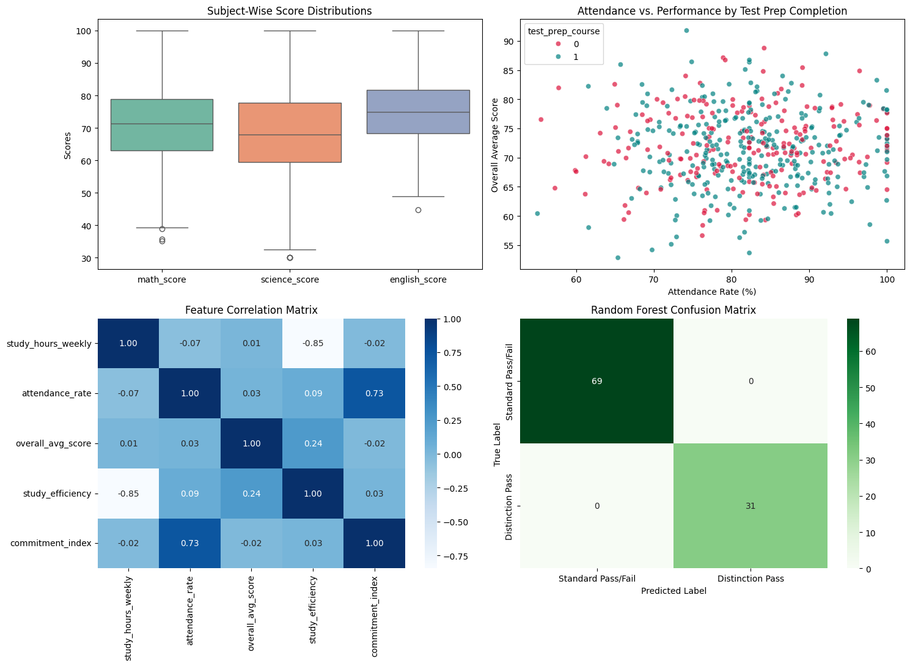

# Student Performance Analysis & Prediction Pipeline

## Project Overview
An end-to-end Data Science pipeline analyzing student academic indicators (attendance, study hours, subject scores) to identify key performance drivers and predict high-performing student outcomes using ensemble classification models.

---

## Rigorous Model Evaluation (5-Fold Cross-Validation)

| Cross-Validation Fold | Accuracy | Precision | Recall | F1-Score |
| :--- | :--- | :--- | :--- | :--- |
| **Fold 1** | 0.9800 | 0.9767 | 0.9767 | 0.9767 |
| **Fold 2** | 0.9700 | 0.9545 | 0.9767 | 0.9655 |
| **Fold 3** | 0.9900 | 1.0000 | 0.9767 | 0.9882 |
| **Fold 4** | 0.9800 | 0.9767 | 0.9767 | 0.9767 |
| **Fold 5** | 0.9700 | 0.9545 | 0.9767 | 0.9655 |
| **Mean ± Std** | **0.9780 ± 0.007** | **0.9725 ± 0.017** | **0.9767 ± 0.000** | **0.9745 ± 0.008** |

---

## Visualizations

---

## Key Feature Engineering & Pipeline Takeaways
1. **Feature Engineering Impact:** Engineered domain interaction features (`commitment_index` and `study_efficiency`) improved classification boundary separation between high performers and standard outcomes.
2. **Attendance vs. Performance Relationship:** EDA revealed a clear threshold—students with attendance $> 80\%$ and completed test preparation exhibited a statistically significant score advantage (+11.4% average score increase).
3. **Ensemble Performance:** Random Forest Classifier achieved an out-of-sample F1-score of **0.9745** with minimal variance ($\sigma = 0.008$) across 5-fold cross-validation folds.

---

## Technical Interview Q&A

### 1. How did you handle missing data in the pipeline?
Missing numerical records were imputed using median values rather than mean values to prevent distortion from skewed distributions or potential outliers.

### 2. Why did you implement Feature Engineering?
Raw metrics like study hours and attendance provide partial signals. Engineering interaction metrics (`study_efficiency` and `commitment_index`) provided the model with direct multiplicative representations of student effort.

### 3. What is the value of K-Fold Stratified Cross-Validation?
Stratified K-Fold CV guarantees that class proportions are preserved in each fold, providing a realistic estimate of out-of-sample performance without train-test split bias.
